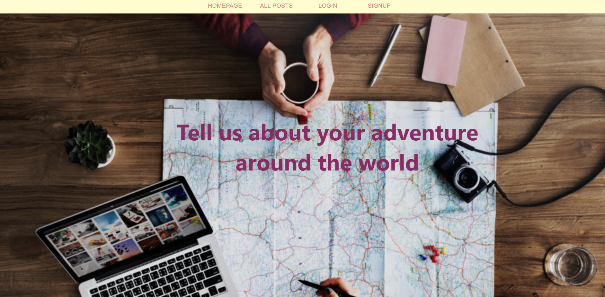

# Explore your next journey 

### Publish your latest journey post 

### Upload photos from your trip
### A place you can be exposed to different places in the world

## Technologies Used
* HTML5
* CSS3
* JavaScript (ES6)
* Git
* GitHub
* React
* Node.js
* MongoDB

## Approach Taken
I started my app by checking out existing apps related to my app. Built a model with 2 collections, one for users, one for posts. Understand the relationships between the various functions, create appropriate components and the relationship between them.
## Wins and Blockers
### Wins

I enjoyed get to know with new things, like authenticatinon and uploading photos, libraries for use and experiment with new techniques.
### Blockers
If I were to make the app again I would give myself more time to create a responsive app.
Use API and add search places in the world and get more information. 

## Visual

[link to the site](https://finalprojectinna.herokuapp.com/)

